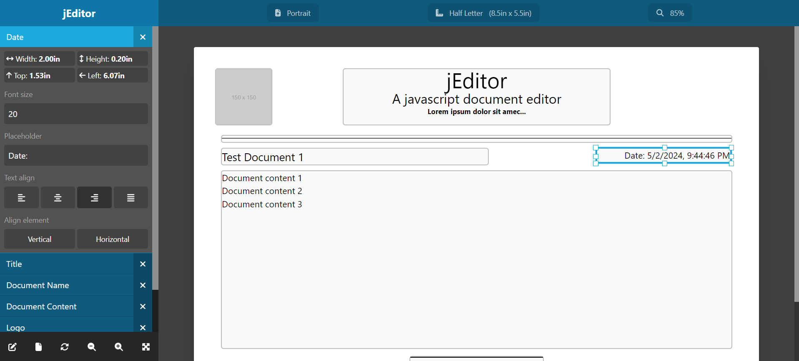

# jEditor (js-document-editor)

## What is jEditor?

jEditor (js-document-editor) is a simple and extensible JavaScript document editor, which allows you to define a document and then drag and resize elements.

Then you can get the position and configuration values from all the elements on the document and generate it as a PDF (using external libraries like `html2Canvas` and `jsPDF`).



## Getting started

The easiest way to get started is to use the Unpkg CDN in your website:

```html
<link
  type="text/css"
  rel="stylesheet"
  href="https://unpkg.com/@medicplus/js-document-editor/dist/jeditor.css"
/>
<script
  src="https://unpkg.com/@medicplus/js-document-editor/dist/jeditor.js"
  type="module"
></script>
```

Using yarn:

```bash
yarn add @medicplus/js-document-editor
```

Using npm:

```bash
npm install @medicplus/js-document-editor --save
```

Now you are ready to use your editor, just create a `<div id="myEditor"></div>` element in your website:

```javascript
// This is not required if you are using CDN imports
import { jEditor } from "@medic-plus/js-document-editor";

// Let's define a simple element
const elements = [{
    key: "my-element",
    text: "My Custom Element",
    value: "<p>Lorem ipsum dolor sit amec...</p>";
    width: 200;
    height: 20;
}];

// Now let's add it to the page, you can also set an empty array and use the UI to manipulate the elements
const data = [{
  element: "my-element";
  left: 100;
  top: 200;
  width: 250;
  height: 25;
}];

// Finally, lets start the editor, this will create a full screen editor
const options = { container: "#myEditor", elements: elements, units: "in" };
const myEditor = new jEditor(options, data);
```

## Documentation

You can check our [GitHub pages site](https://medic-plus.github.io/js-document-editor/) with the full options and functions list and some examples on what you can do

## What's new on v3.x?

A full redesign of the UI has been implemented on this new version, and a full rewrite of the library in TypeScript, other changes are:

- Library code reimplemented with TypeScript to improve on type error checking
- UI redesigned with Tailwind instead of plain CSS code
- FontAwesome icons now included with the library
- Moved from using NPM to Yarn
- Migrated to Vite instead of Webpack (dropper support for old browsers)

## Migrating from v2.x

You can find the details on the [Migration guide](https://medic-plus.github.io/js-document-editor/pages/migrate-v2.x-v3.x.html)

## License

jEditor is release under the MIT license. You are free to use, modify and distribute this software.
