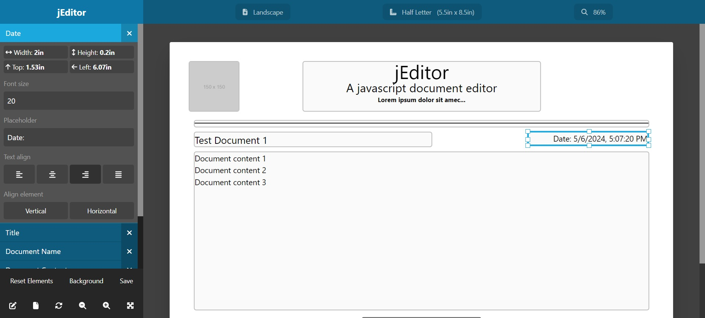
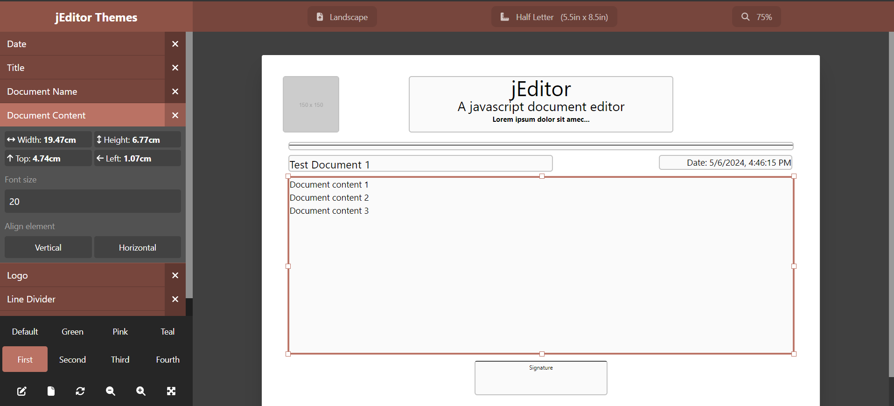

### [Live demo](../examples/index.html)

A simple demo with the main basic features

- [Example code](https://github.com/medic-plus/js-document-editor/blob/main/docs/examples/index.html)



### [Themes demo](../examples/themes/index.html)

Here you can change the theme to any of the defined themes or a custom one

- [Example code](https://github.com/medic-plus/js-document-editor/blob/main/docs/examples/themes/index.html)
- [Generate your own Tailwind theme](https://uicolors.app/create)



You can write your own theme with this format:

```css
[data-container="jeditor"][data-theme="custom"] {
  --primary-50: #fbf6f5;
  --primary-100: #f6ecea;
  --primary-200: #f0dcd8;
  --primary-300: #e4c3bd;
  --primary-400: #d3a096;
  --primary-500: #ba7264;
  --primary-600: #aa6558;
  --primary-700: #8e5347;
  --primary-800: #77463d;
  --primary-900: #643f38;
  --primary-950: #351e1a;
}
```

### [Localized demo](../examples/localized/index.html)

In this live demo you can change the editor locale (UI and elements) to any of the supported locales

- [Example code](https://github.com/medic-plus/js-document-editor/blob/main/docs/examples/localized/index.html)


### [Generate PDF](../examples/pdf/index.html)

Here you can see an example of how to generate a PDF file based on the values from the editor using the libraries `html2canvas` and `jsPDF`

- [Example code](https://github.com/medic-plus/js-document-editor/blob/main/docs/examples/pdf/index.html)
- [html2canvas](https://github.com/niklasvh/html2canvas)
- [jsPDF](https://github.com/parallax/jsPDF)


